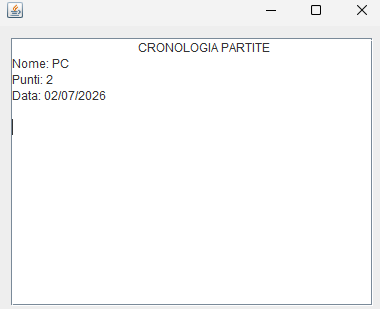
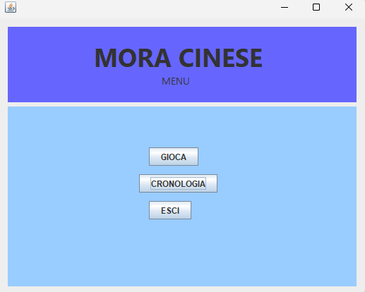
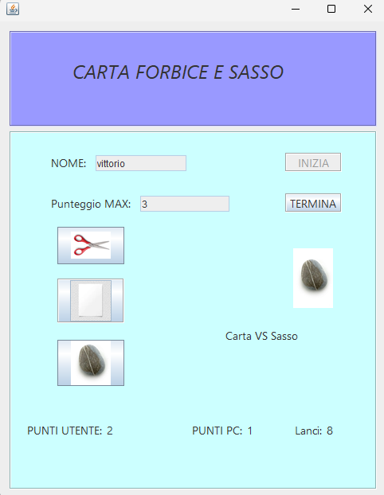

# **Paper Scissor and Rock**
The application starts with a menu where you can choose whether to play, see the history of who has won with the scores and the date when the game is saved, it simulates rock paper scissors between user and PC with a button, at the beginning the user must first enter his username and the score where he must reach, then, to start the game you have to click a start button and the user can choose his move, and with an animation effect, that is, a pause of about 1 second, the PC shows his move and compares who has won that round to then assign the point and as soon as the chosen score is reached, whoever has the highest score wins and is saved in a .txt file that can be used from the main menu as mentioned above.

and here are some images of the game

